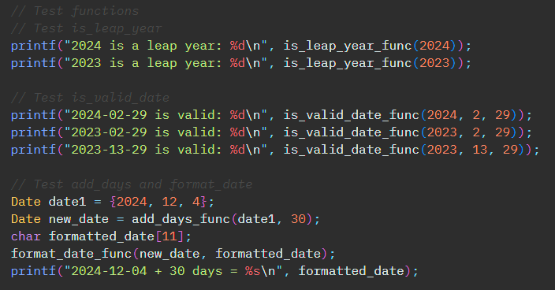
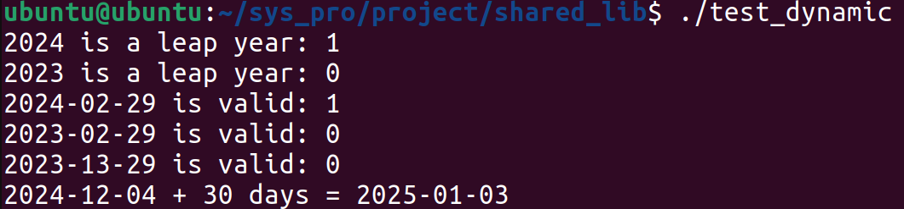

*이 레포지토리는 시스템 프로그래밍 교과목의 리눅스 utility libraray project 구현 파일의 집합입니다.*

# 날짜 유틸리티 라이브러리

## 라이브러리 설명
리눅스 시스템에서 사용할 수 있는 날짜 처리 유틸리티입니다. 날짜 포맷팅, 날짜 유효성 검사 및 조작 기능을 제공합니다.  
-shared_lib 디렉토리에는 dynamic linking으로 구현된 shared library (.so) 파일
-static_lib 디렉토리에는 static library (.a) 파일이 있습니다.

### 주요 기능
- 특정 날짜로부터 N일 계산
- 날짜 형식 변환 (YYYY-MM-DD → MM/DD/YYYY)
- 윤년을 포함한 날짜 유효성 검사
- 
### 레포지토리 구성
```bash
Date-utilities-for-syspro/
│
├── shared_lib/
│   ├── date_utilities.c
│   ├── date_utilities.h
│   ├── libdate.so
│   ├── test_date.c
│   └── test_dynamic
│
├── static_lib/
│   ├── date_utilities.c
│   ├── date_utilities.h
│   ├── date_utilities.o
│   ├── libdate.a
│   ├── test_date.c
│   └── test_static
│
├── README.md
```


## 라이브러리 빌드 및 테스트 방법
### 필수 요구사항
- Ubuntu 22.04.4 LTS
- GCC 11.4.0

### static library 컴파일 및 실행
1. static library 생성
```bash
gcc -c date_utilities.c
ar rcs libdate.a date_utilities.o
```
2. static library를 이용하여 테스트 코드 컴파일
```bash
gcc -o test_static test_date.c -L. -ldate
```
3. 테스트 코드 실행
```bash
./test_static
```

### shared library 컴파일 및 실행
1. shared library 생성
```bash
gcc -shared -fPIC -o libdate.so date_utilities.c
```
2. shared library를 이용하여 테스트 코드 컴파일
```bash
gcc -o test_dynamic test_date.c -ldl
```
3. 테스트 코드 실행
```bash
./test_dynamic
```

## 사용 예시 (테스트 프로그램)
### 샘플 코드

### 샘플 출력

